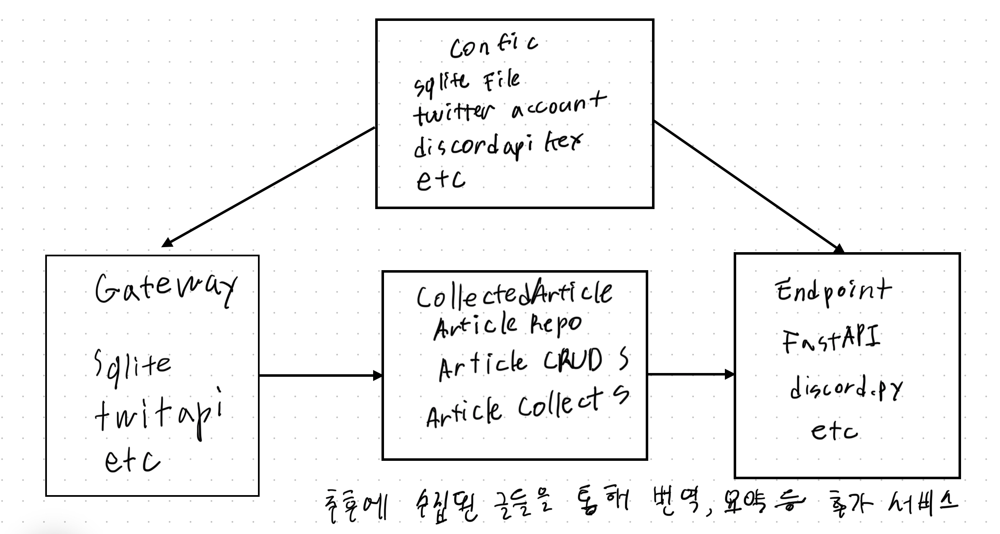

# AI Hype Summarizer

## Getting Started

1. 프로젝트 클론
2. `cp config.yaml.example config.yaml` 명령어로 config.yaml 파일 생성
3. config.yaml 파일의 설정값들을 수정
4. `uv sync` 명령어로  의존성 설치
5. `uv run -m backend.app` 명령어로 현재 sqlite3 db를 생성하고 테이블 생성 후 row를 삽입하는 코드 실행

## Diagram

